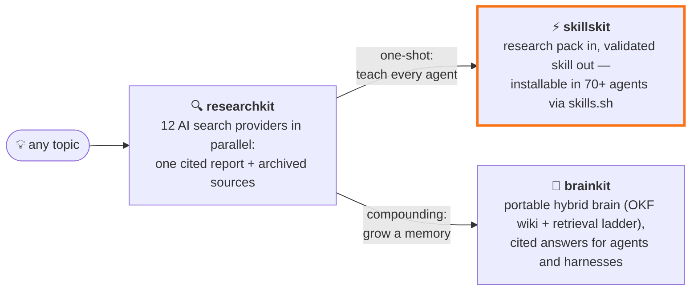

<p align="center">
  
</p>

# skillskit

[](https://github.com/Paldom/skillskit/actions/workflows/ci.yml)

[](https://skills.sh/Paldom/skillskit)

Turn research into agent skills that actually fire — scaffolding, eval-first
authoring, a validating gate, and a deliberate path to skills.sh.

## Demo


A skill whose description quietly overlaps a sibling still looks fine in review, and
still fails to trigger. Here two descriptions are made near-identical on purpose:
accuracy falls from 88.9% to 66.7%, the prompts that lost their skill are named, and
the gate goes red. The demo is code — [`docs/demo/demo.tape`](docs/demo/demo.tape),
regenerated with `vhs docs/demo/demo.tape`.

## Quick start

```bash
npx skills add Paldom/skillskit
```

Then talk to your agent. Every example below is something you type — never a script
inside a skill:

```text
turn the research pack in ./research into skills
```

```text
/add-skill a skill that reviews SQL migrations for lock risk
```

That is the whole interface. `/skill-from-research` reads the pack, verifies its
claims against primary sources, and writes each finding as a single-purpose,
eval-first skill; `/add-skill` does one skill at a time in any repo.

### Other ways to install

```bash
npx skills add Paldom/skillskit -a codex -a pi   # target specific agents
gh skill install Paldom/skillskit                # GitHub CLI ≥ 2.90
```

```text
/plugin marketplace add Paldom/skillskit
/plugin install skillskit@skillskit
```

Working inside this checkout? Codex and other
[Agent Skills](https://agentskills.io)-standard agents discover the same five skills
through `.agents/skills/` with no install at all.

## Skills

| Skill | Ask it when | Invoke |
| --- | --- | --- |
| [skill-from-research](skills/skill-from-research/) | You have reports, notes or transcripts and want skills out of them | `/skill-from-research <path>` |
| [create-skill-repo](skills/create-skill-repo/) | The skills need a home — a whole repo, wired up | `/create-skill-repo <name>` |
| [add-skill](skills/add-skill/) | One skill, in any repo, authored or repaired properly | `/add-skill <idea>` |
| [publish-repo](skills/publish-repo/) | It is ready and you want it on skills.sh | `/publish-repo` |
| [upgrade-repo](skills/upgrade-repo/) | A repo you generated months ago has stale tooling | `/upgrade-repo` |

## The flow

1. **[Required]** Gather the material — reports, notes, transcripts, examples — into
   one folder. What makes a good pack:
   [research-pack.md](skills/skill-from-research/references/research-pack.md).
2. **[Required]** Distil it: `/skill-from-research <path>`. The pack is inventoried,
   read in full, verified against primary sources, and split into single-purpose
   skills, each written evals-first.
3. **[Optional]** No repo yet? `/create-skill-repo <name>` scaffolds one first —
   OSS hygiene, CI, hooks, the validating gate, distribution manifests.
4. **[Required]** Review. Everything stays uncommitted in your working tree; you
   read the diff, you commit.
5. **[Afterward]** Ship it: `/publish-repo` walks the gates, visibility, protections,
   release and verification.
6. **[Afterward]** When this kit improves, `/upgrade-repo` carries the change back
   into repos you generated earlier — see the
   [upgrade log](skills/upgrade-repo/references/upgrade-log.md).

Full walkthrough: [docs/guide.md](docs/guide.md).

## Where this fits



[researchkit](https://github.com/Paldom/researchkit) does the digging; skillskit turns
the pack into a skill you install once and reuse everywhere. Want compounding memory
instead of a packaged skill? Grow a brain with
[brainkit](https://github.com/Paldom/brainkit).

## What the gate checks

`make check` is the whole gate, and it runs on every write, every commit and every PR:

- **Frontmatter and structure** — the strict YAML subset that loads in every runtime.
- **Trigger evals, executed** — every eval prompt scored against every description in
  the repo, so a drifting or colliding description fails the build. Current rank-1
  routing accuracy: **88.9%**, ratcheted in CI. It is a lexical proxy for the model's
  router, not the router; [docs/evals.md](docs/evals.md) is explicit about what that
  does and does not prove.
- **Security** — skill content and every bundled script scanned for what registry
  audits keep finding: downloads piped into a shell, environments posted to a
  collector, `shell=True`, instructions that act without telling the user.
- **Ruff** — lint and format over everything shipped, bandit rules included.
- **README** — the shape in [docs/readme-standard.md](docs/readme-standard.md).

## Repository structure

```
skills/                        # the five distributed skills (this is what installs)
  create-skill-repo/assets/template/   # the complete repo scaffold, shipped inside the skill
docs/                          # flow guide, authoring rulebook, eval methodology, README standard
scripts/                       # the gate: validator, eval scorer, self-checks
.claude/                       # dogfood: hooks that validate and lint every write here
.claude-plugin/                # plugin + marketplace manifests
skills.sh.json                 # skills.sh repo-page groupings
```

Canonical agent instructions live in [AGENTS.md](AGENTS.md) (CLAUDE.md imports it).
`make hooks` installs the commit-time layer.

## Contributing

Contributions welcome — see [CONTRIBUTING.md](CONTRIBUTING.md) for the
skill-proposal process and the eval-first authoring workflow. Please note the
[Code of Conduct](CODE_OF_CONDUCT.md).

## Support

Questions, ideas, or something not working? Start with [SUPPORT.md](SUPPORT.md) —
bugs and skill proposals have [issue templates](../../issues/new/choose), and
security concerns go through [SECURITY.md](SECURITY.md) (never a public issue).

## License

[MIT](LICENSE) © 2026 Domonkos PAL
